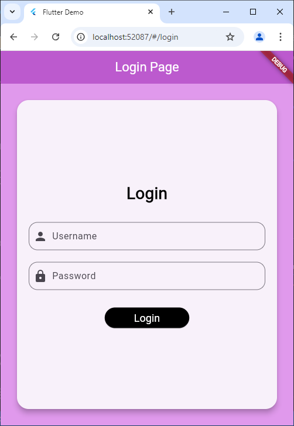
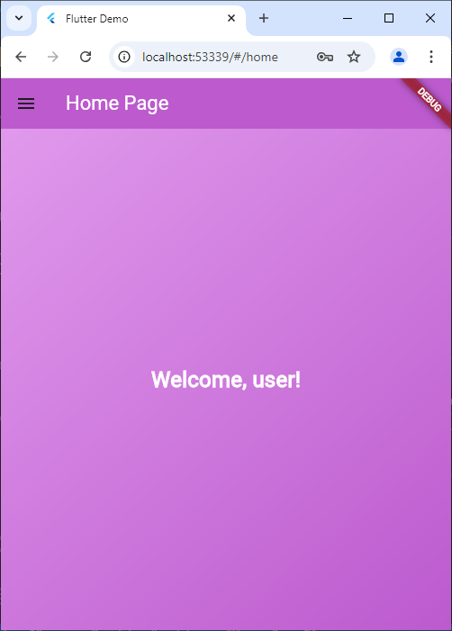
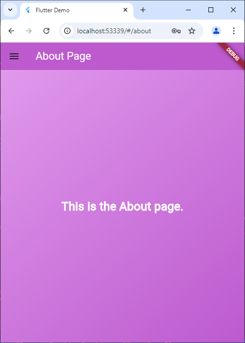
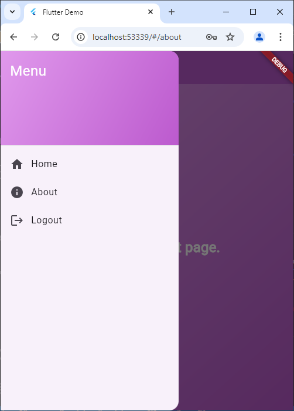

# Tugas Pertemuan 3

Nama : Muthia Khanza
NIM : H1D022008
Shift Baru : C
Shift Lama : A

## Penjelasan

Halaman Login:
Halaman login dibuat dengan autentikasi menggunakan `SharedPreferences` untuk menyimpan sesi login. Halaman login ini dibangun menggunakan `StatefulWidget` bernama `LoginPage`, dengan `TextEditingController` untuk menangani input username dan password. Saat tombol "Login" ditekan, metode `_login` memvalidasi apakah username adalah "user" dan password "password". Jika benar, username disimpan dan pengguna diarahkan ke halaman '/home'; jika salah, pesan kesalahan ditampilkan melalui `SnackBar`. Tampilan halaman diatur menggunakan `Scaffold`, yang mencakup `AppBar`, `Container`, dan `Card` untuk membuat tampilan dengan form input dan tombol login.

Halaman Home:
Halaman beranda (`HomePage`) menampilkan nama pengguna yang tersimpan menggunakan `SharedPreferences` dan menyediakan menu (`SideMenu`) untuk navigasi. `HomePage` menggunakan`StatefulWidget` untuk menampilkan nama pengguna melalui variabel `_username`, yang diinisialisasi sebagai "Guest." Saat halaman dimuat, metode `initState` memanggil `_loadUsername()` untuk mendapatkan data pengguna dari `SharedPreferences`. Nama pengguna yang tersimpan ditampilkan dengan menggunakan `setState` untuk memperbarui tampilan. Struktur antarmuka dikelola oleh `Scaffold` dengan `AppBar` berjudul "Home Page" dan `drawer` yang terhubung ke `SideMenu`. Bagian `body`dan teks "Welcome, [username]!" yang berada di tengah layar dengan menampilkan nama user yang melakukan login

Halaman About:
Halaman "AboutPage" ini adalah halaman statis yang menampilkan informasi tentang aplikasi. `AboutPage` menggunakan`StatelessWidget` dan menggunakan `Scaffold` untuk membangun struktur halaman, termasuk `AppBar` dengan judul "About Page" dan warna latar ungu. Halaman ini juga memiliki menu samping (`SideMenu`) untuk navigasi. Bagian `body` menggunakan `Container` dengan latar belakang ungu, yang diatur menggunakan `BoxDecoration` dengan `LinearGradient`. Di tengah halaman, terdapat teks "This is the About page." yang ditampilkan.

Sidebar:
`SideMenu` dibuat menjadi Widget yang digunakan untuk navigasi dalam aplikasi. `SideMenu` menggunakan `StatelessWidget` dan menggunakan `Drawer` sebagai komponen utama untuk menampilkan menu. `Drawer` ini berisi `ListView` dengan beberapa item, diawali oleh `DrawerHeader` yang menampilkan judul "Menu" . Di bawahnya, terdapat tiga `ListTile` yang mewakili opsi menu: "Home," "About," dan "Logout." Setiap opsi menu memiliki ikon dan teks, dan ketika dipilih, pengguna akan dinavigasi ke halaman yang sesuai melalui `Navigator.pushReplacementNamed`. Pada opsi "Logout," data `SharedPreferences` akan dihapus untuk menghapus sesi pengguna sebelum mengarahkan kembali ke halaman login.

## Screenshoot Tampilan

